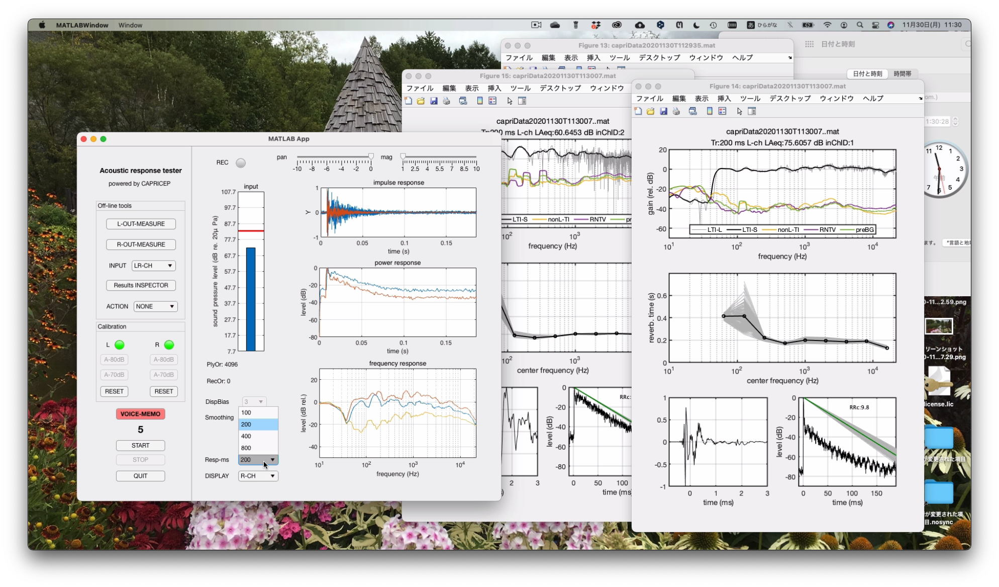

# CAPRICEP
New TSP

All components are uploaded. Type "realTimeTester" to start the application. Supporting materials will be ready soon. 

## Reference

Kawahara, H. and Yatabe, K.: Cascaded all-pass filterswith randomized center frequencies and phase polarity for　acoustic and speech measurement and data augmentation,arXiv:2010.13185(2020).

### Abstract

We introduce a new member of TSP (Time Stretched Pulse) for acoustic and speech measurement infrastructure, 
based on a simple all-pass filter and systematic randomization. 
This new infrastructure fundamentally upgrades our previous measurement procedure, 
which enables simultaneous measurement of multiple attributes, including non-linear ones
without requiring extra filtering nor post-processing. 
Our new proposal establishes a theoretically solid, flexible, and extensible foundation in acoustic measurement.
Moreover, it is general enough to provide versatile research tools for other fields, such as biological signal analysis.
We illustrate using acoustic measurements and data augmentation as representative examples among various prospective applications. 
We open-sourced MATLAB implementation. 
It consists of an interactive and real-time acoustic tool, MATLAB functions, and supporting materials.

## Interactive and real-time acoustic measurement tool

Try "realTimeTester" to invoke the tool.

Use "capResultReporter" for visualize and report the measurement results

## Off-line acoustic measurement

Try:

    Fs = 44100;
    tResponse = 200;
    nRepetition = 30;
    outChannel = 'L-ch';
    inChannel = 1;
    
    analysisStr = capricepResponseTest(fs, tResponse, nRepetition, outChannel, inChannel)
    specStr = capricepResponseAnalysis(analysisStr)
    reportStr = capricepResponseReport(specStr)

For usual room, tResponse = 400; provides better result in the low-frequency end. 800 is better for a classroom.

## Sample files

The following files sound pervcptually indistinguishable (at least for me).

Please refer to Fig.5 of the reference.

 ### The worst SNR (-1dB) file filtered by CAPRICEP

capricepWorstSNRminus1dB.wav

### The best SNR (6dB) file filtered by CAPRICEP

capricepBestSNR6dB.wav

### The original file (level adjusted to CAPRICEP samples)

originalLevelAdjusted.wav

## Links to installer of compiled stand alone application

These installers are not up to date (30 Nov. 2020). They will be updated by 2 Dec. 2020;

### Installer for macOS

Please download this folder as a whole. 

### Installer for Windows10 (64bit)

## Memo (working)

### Revised for resilience (02 Dec. 2020)
### Multi channel input (30 Nov. 2020)
### Generalized for multi input channels and added test code (27 Nov. 2020) Note: only for off-line measurement
### Data inspection fundtion added (24 Nov. 2020)
### Event detection refinement 
### Bug fix in reverberation time and made robust (23 Nov. 2020)
### Added test folder
### Visualization and report function is added (20 Nov. 2020).
### Detailed report added (13 Nov. 2020).
### Figure appearance compatibility in report is now better (12 Nov. 2020).
### All components are uploaded. Type "realTimeTester" to start the application
### Added off-line analysis function
### Uploaded unit-CAPRICEPs for 100, 200, 400, 800, and 1600 ms
