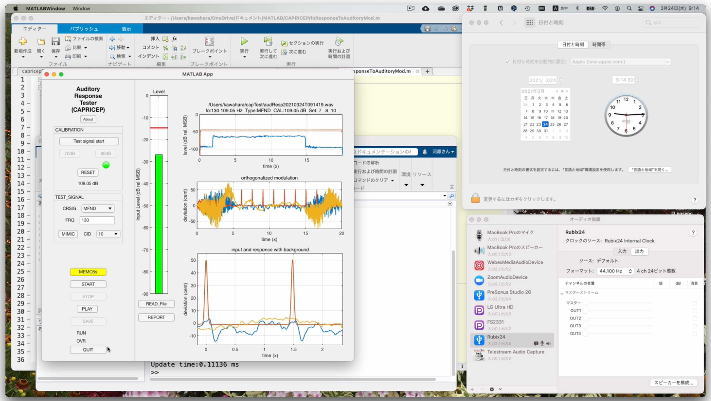

# CAPRICEP
An extended TSP (Time Stretched Pulse) that enables interactive and real-time measurement of the linear time-invariant, the non-linear time-invariant, and random and time varying responses simultaneously. This is the substantial revision of FVN and related tools. I will stop updating FVN.

All components are uploaded. Type "realTimeTester" to start the application. Supporting materials will be ready soon. 

## Reference

Kawahara, H. and Yatabe, K.: Cascaded all-pass filterswith randomized center frequencies and phase polarity for　acoustic and speech measurement and data augmentation,arXiv:2010.13185(2020) (Accepted: ICASSP2021).
[(Link to PDF) ](https://arxiv.org/pdf/2010.13185.pdf)

### Abstract

We introduce a new member of TSP (Time Stretched Pulse) for acoustic and speech measurement infrastructure, 
based on a simple all-pass filter and systematic randomization. 
This new infrastructure fundamentally upgrades our previous measurement procedure, 
which enables simultaneous measurement of multiple attributes, including non-linear ones
without requiring extra filtering nor post-processing. 
Our new proposal establishes a theoretically solid, flexible, and extensible foundation in acoustic measurement.
Moreover, it is general enough to provide versatile research tools for other fields, such as biological signal analysis.
We illustrate using acoustic measurements and data augmentation as representative examples among various prospective applications. 
We open-sourced MATLAB implementation. 
It consists of an interactive and real-time acoustic tool, MATLAB functions, and supporting materials.
Recently we introduced an interactive and real-time tool for measureing voice fundamental frequency response to auditory test signal with frequency modulation.

## Measurement of pitch extractors' response to FM test signal of simulated vowel /a/

Folder "fmResponseTester" consists of the tester. The following command tests MATLAB's pitch extractor function "pitch.m" using a test signal with 240 Hz pitch and 1 cent modulation depth. The output reports (graphics and MATLAB data) are stored on the current working directory. The last argument "@pitchNCF" is a function pointer to the interface program (user has to write) for the target pitch extractor (a MATLAB function "pitch.m").

    ncfOut = fmTransfTestGaussN(240, 1, pwd, @pitchNCF)
  
For technical details refer the following.

### Reference

Hideki Kawahara, Kohei Yatabe, Ken-Ichi Sakakibara, Tatsuya Kitamura, Hideki Banno, Masanori Morise: Objective measurement of pitch extractors' responses to frequency modulated sounds and two reference pitch extraction methods for analyzing voice pitch responses to auditory stimulation,	arXiv:2111.03629 (2021).
[(Link to PDF) ](https://arxiv.org/pdf/2111.03629.pdf)

Note that fmTransfTestGaussN is a new replacement of fmTransfTestGauss

## Interactive and real-time tool for measureing voice fo response to FM test signals

Dwonload the directory "auditoryResponseTester." Then, try "auditoryResponseTester" to invoke the tool.

### Getting started: instruction manual

English and Japanese versions are in doc folder.

### Reference

Hideki Kawahara, Toshie Matsui, Kohei Yatabe, Ken-Ichi Sakakibara, Minoru Tsuzaki, Masanori Morise, Toshio Irino: Mixture of orthogonal sequences made from extended time-stretched pulses enables measurement of involuntary voice fundamental frequency response to pitch perturbation,	arXiv:2104.01444 (2021).
[(Link to PDF) ](https://arxiv.org/pdf/2104.01444.pdf)

The following method is adopted for CAPRICEP and build in this tool.

Hideki Kawahara; Ken-Ichi Sakakibara; Mitsunori Mizumachi; Masanori Morise; Hideki Banno: Simultaneous measurement of time-invariant linear and nonlinear, and random and extra responses using frequency domain variant of velvet noise,	Proc. APSIPA ASC, pp.174-183 (2020).
[(Link to PDF) ](http://www.apsipa.org/proceedings/2020/pdfs/0000174.pdf)

## Interactive and real-time acoustic measurement tool

Try "realTimeTester" to invoke the tool.

Use "capResultReporter" for visualize and report the measurement results

## Off-line acoustic measurement

Try:

    app = struct;
    app.CommonSignal = struct;
    devices = getAudioDevices(audioPlayerRecorder);
    [deviceID,tf] = listdlg('ListString',devices, 'SelectionMode','single');
    if tf
        app.CommonSignal.DeviceName = devices{deviceID};
        app.DeviceLabel.Text = devices{deviceID};
        fs = 44100;
        app.CommonSignal.Reader = audioPlayerRecorder(fs,"RecorderChannelMapping", 1, ...
            "BitDepth", "24-bit integer", "Device", devices{deviceID});
        app.DriverLabel.Text = 'simultaneousIO'; %get(app.CommonSignal.Reader,"Driver");
        tResponse = 400;
        nRepetition = 30;
        outChannel = 'L-ch';
        option.calibrationConst = 200;
        inChannel = 1;
        option.DeviceName = devices{deviceID};
        analysisStr = capricepResponseTest(fs, tResponse, nRepetition, ...
            outChannel, inChannel, 'acoustic_system', option);
        analysisStrCore = struct;
        analysisStrCore.yRecorded = analysisStr.yRecorded;
        analysisStrCore.pinkLPC = analysisStr.pinkLPC;
        analysisStrCore.fs = fs;
        analysisStrCore.tResponse = analysisStr.tResponse;
        analysisStrCore.nRepetition = analysisStr.nRepetition;
        analysisStrCore.outChannel = analysisStr.outChannel;
        analysisStrCore.numChannels = analysisStr.numChannels;
        analysisStrCore.selectedChannels = analysisStr.selectedChannels;
        analysisStrCore.lAeq = analysisStr.lAeq;
        analysisStrCore.calibrationConst = analysisStr.calibrationConst;
        app.CommonSignal.outPath = ".";
        fname = "test";
        save(app.CommonSignal.outPath + "/" + fname, "analysisStrCore");
        tmp = capResultReporter([char(app.CommonSignal.outPath)   '/'  char(fname)], 'NONE');
      end
    
For usual room, tResponse = 400; provides better result in the low-frequency end. 800 is better for a classroom.

## Sample files

The following files sound pervcptually indistinguishable (at least for me).

Please refer to Fig.5 of the reference. Please download and check.

 ### The worst SNR (-1dB) file filtered by CAPRICEP

capricepWorstSNRminus1dB.wav

### The best SNR (6dB) file filtered by CAPRICEP

capricepBestSNR6dB.wav

### The original file (level adjusted to CAPRICEP samples)

originalLevelAdjusted.wav

## Links to installer of compiled stand alone application

These installers are still experimental (17 Jan. 2021);

### Installer for macOS

[Link to installer ](https://drive.google.com/drive/folders/1v0TTaMb3Ka2xAND4TOLt_eaov3qfePtq?usp=sharing)
Please download this folder as a whole. Then, execute as the installer application.

### Installer for Windows10 (64bit)

[Link to installer ](https://drive.google.com/file/d/12tj_JiQiDLYMiBZaEckRQCQy0aaxfFpb/view?usp=sharing)
Please click this link. Then execute the downloaded installer application.

## Memo (working)

### Auditory to response tester bug fix and update (03 Sept. 2021)
### Urgent bug fix release for OTOGAKU symposiun (18 June 2021)
### Auditory to voice fo response tester is added (6 April 2021)
### Driver assignment is added to off-line measurement function (13 March 2021)
### Calibration error and driver compatibility issue fixed (08 March 2021)
### Voice memo fix for ASIO compatibility (25 Jan. 2021)
### Tuning for Windows (24 Jan. 2021)
### Minor fix of GUI behavior (23 Jun. 2021)
### 192kHz sampling measurement is now functional on Windows (23 Jan. 2021)
### Binary installers are updated (17 Jan. 2021)
### 192kHz sampling rate for off-line measurement is added (16.Jan. 2021)
### Buf fix for report vertical axis shouw sound pressure level now (16 Jan. 2021)
### Bug fix for off-line measurement (22 Dec. 2020)
### Added 176400 Hz and 192000 Hz sampling frequency for off-line measurement functions
### Revised event detection (05 Dec. 2020)
### Revised for resilience (02 Dec. 2020)
### Multi channel input (30 Nov. 2020)
### Generalized for multi input channels and added test code (27 Nov. 2020) Note: only for off-line measurement
### Data inspection fundtion added (24 Nov. 2020)
### Event detection refinement 
### Bug fix in reverberation time and made robust (23 Nov. 2020)
### Added test folder
### Visualization and report function is added (20 Nov. 2020).
### Detailed report added (13 Nov. 2020).
### Figure appearance compatibility in report is now better (12 Nov. 2020).
### All components are uploaded. Type "realTimeTester" to start the application
### Added off-line analysis function
### Uploaded unit-CAPRICEPs for 100, 200, 400, 800, and 1600 ms
